# Impact Inbox — Architecture & Roadmap

Email builder + email marketing platform. Monorepo, contract-first API, workspace-scoped multi-tenancy.

---

## 1. Product vision

| Layer | Responsibility |
|-------|----------------|
| **Web** (`apps/web`) | Builder UI, campaign management, analytics dashboards |
| **API** (`apps/api`) | Auth, tenancy, business rules, orchestration |
| **Shared** (`packages/shared`) | Zod schemas, API types, constants — single contract for API + web |
| **DB** (`packages/db`) | Drizzle schema, migrations, typed queries |
| **Workers** (future) | Campaign sends, webhooks, analytics ingestion |

---

## 2. Monorepo topology

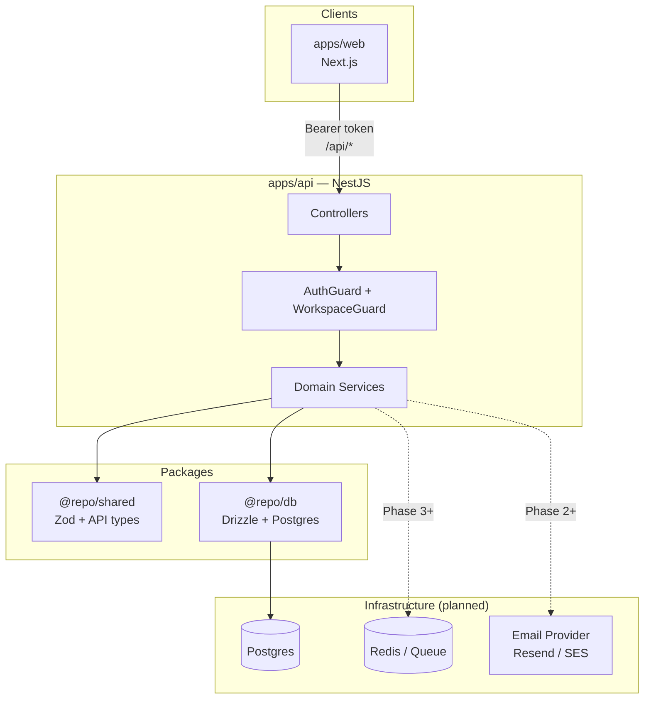

---

## 3. Current state (implemented)

### 3.1 API modules & responsibilities

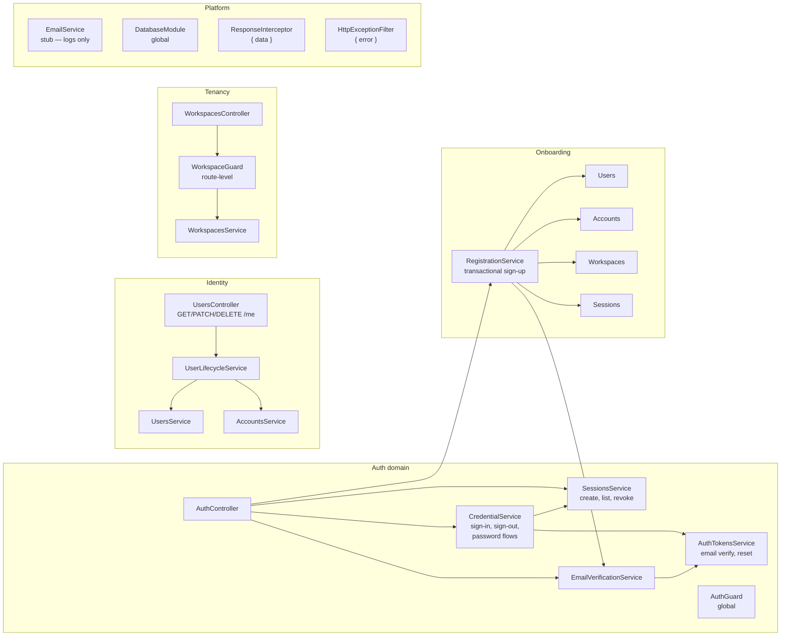

| Module | Service | Does | Does not |
|--------|---------|------|----------|
| **Auth** | `CredentialService` | Sign-in/out, change/forgot/reset password | Create users, workspaces |
| **Auth** | `SessionsService` | Session CRUD, validation | Issue JWT |
| **Auth** | `AuthTokensService` | One-time tokens (verify email, reset pwd) | Send emails |
| **Auth** | `EmailVerificationService` | Token lifecycle + dispatch | Store passwords |
| **Onboarding** | `RegistrationService` | Atomic sign-up orchestration | Standalone HTTP routes |
| **Users** | `UsersService` | User persistence | Auth decisions |
| **Users** | `UserLifecycleService` | Profile update, account deletion | Raw CRUD exposure |
| **Accounts** | `AccountsService` | Password hash storage | HTTP layer |
| **Workspaces** | `WorkspacesService` | Workspace + member CRUD | Cross-workspace queries |
| **Email** | `EmailService` | Delivery abstraction (stub) | Template rendering |

### 3.2 Database (current)

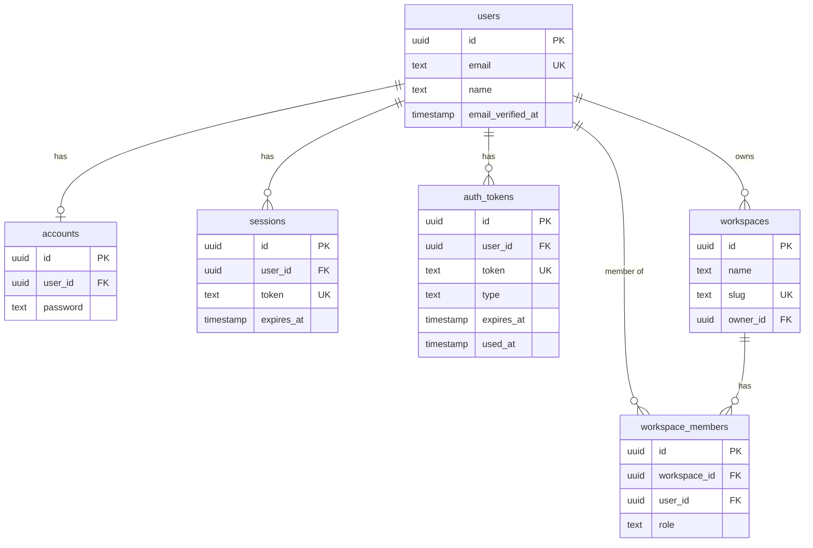

### 3.3 Request pipeline (every API call)

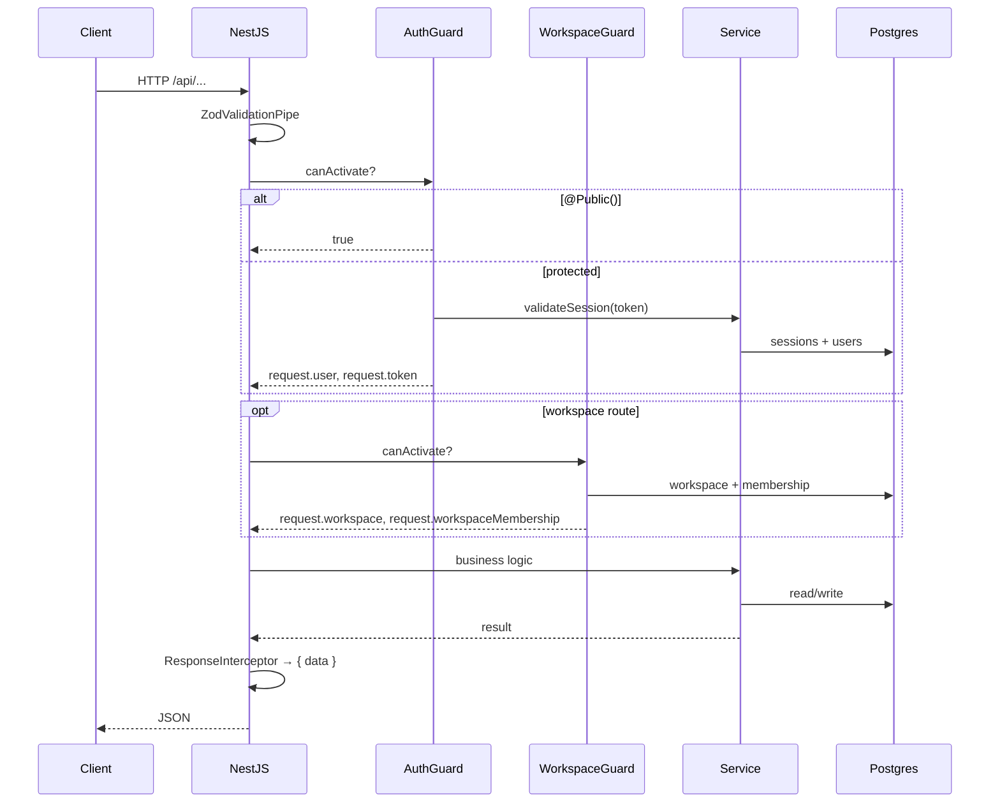

---

## 4. Core data flows

### 4.1 Sign-up (implemented)

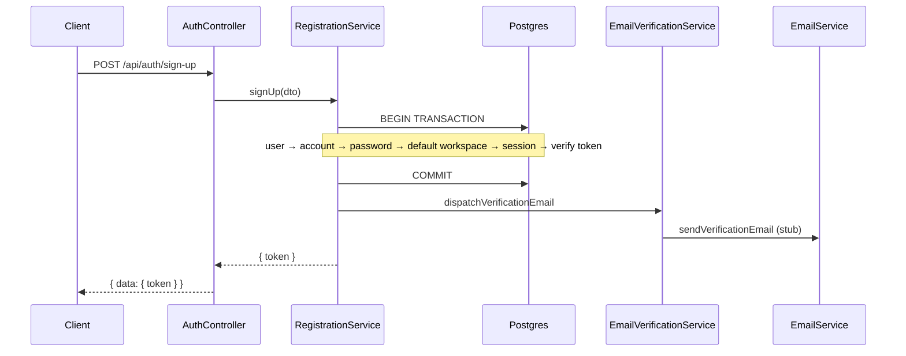

### 4.2 Authenticated workspace request (implemented)

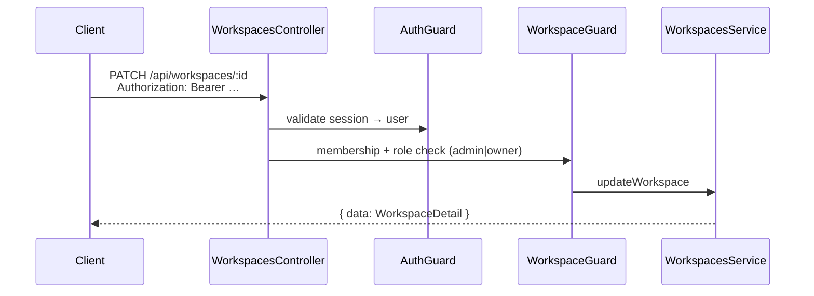

### 4.3 Campaign send (target — not built)

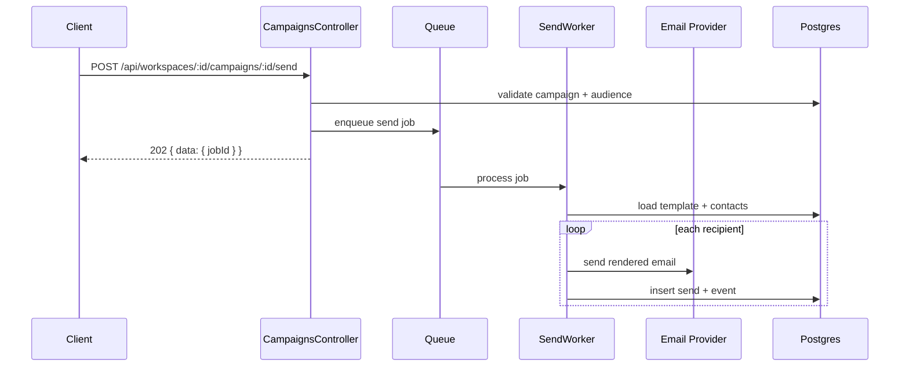

---

## 5. Target domain model (email product)

All business entities are **workspace-scoped**.

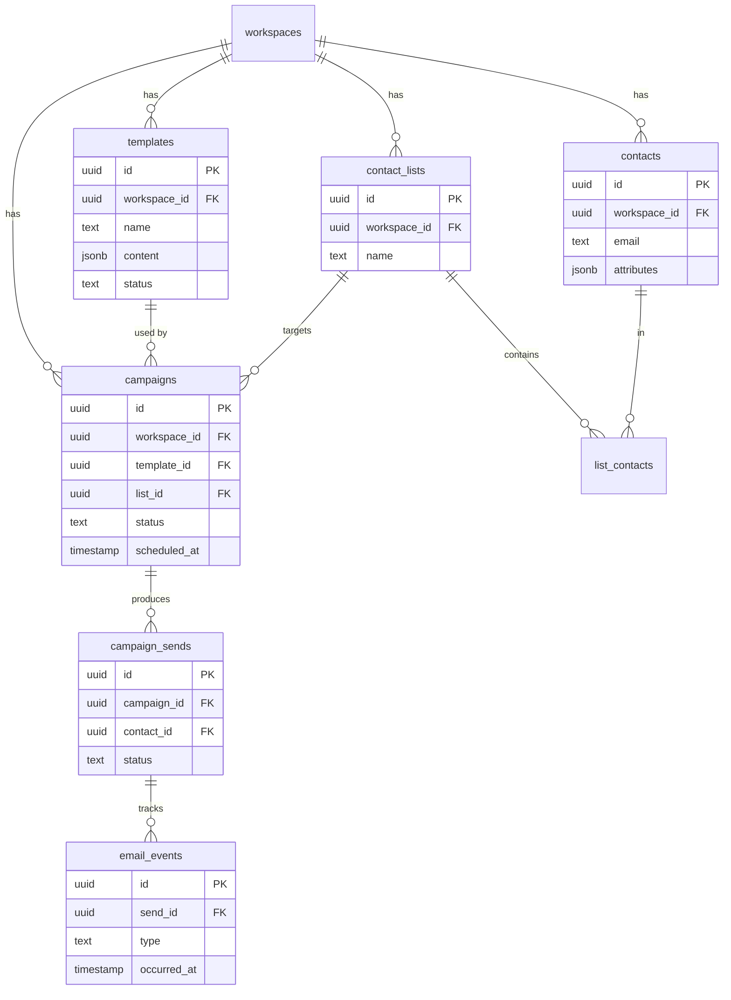

---

## 6. Target module map (API)

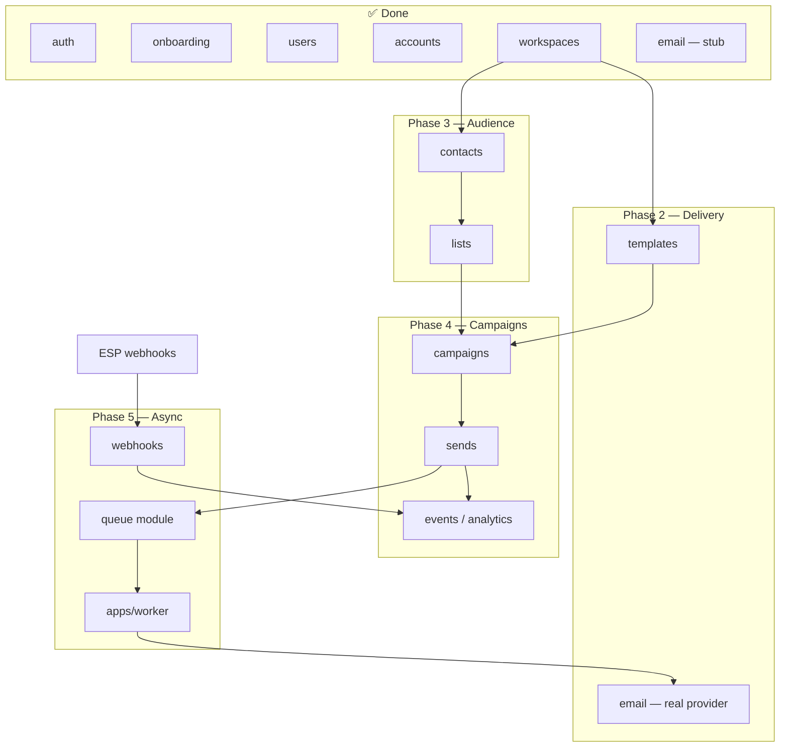

**Dependency rule:** feature modules import `WorkspacesModule` (or use `WorkspaceGuard`). They never query across workspaces without an explicit `workspaceId` from the route.

---

## 7. Shared contract strategy

```
packages/shared
├── schemas/          # Zod input validation
├── auth-responses.ts # Response DTO shapes
├── api.ts            # ApiResponse, error codes
└── constants.ts      # roles, TTLs, enums
```

| Consumer | Uses shared for |
|----------|-----------------|
| `apps/api` | DTOs via `createZodDto`, response types |
| `apps/web` | Form validation, fetch response typing |
| `packages/db` | Enums (`WorkspaceRole`, token types) |

**Convention:** every public endpoint has a Zod schema + exported inferred type in `@repo/shared` before the web app calls it.

---

## 8. Phased roadmap

### Phase 0 — Foundation ✅ (mostly done)

- [x] Monorepo + NestJS + Drizzle + Postgres
- [x] Global `/api` prefix, `{ data }` / `{ error }` envelope
- [x] Auth: sessions, sign-up/in/out, password flows, email verification tokens
- [x] Users: `/users/me`, profile, delete account
- [x] Workspaces: CRUD, members, roles, `WorkspaceGuard`
- [x] Transactional registration (user + account + workspace + session)
- [ ] CORS for `apps/web`
- [ ] `GET /api/health`
- [ ] Drizzle migrations committed + CI migrate
- [ ] Auth + workspace E2E tests

### Phase 1 — Web shell (2–3 weeks)

Goal: web app can authenticate and navigate workspaces.

| Task | API | Web |
|------|-----|-----|
| API client + token storage | — | `lib/api-client.ts` |
| Login / sign-up pages | existing routes | forms + Zod from shared |
| Session bootstrap | `GET /users/me`, `GET /workspaces` | layout + redirect |
| Workspace switcher | `GET /workspaces` | context / URL `:workspaceSlug` |
| Error handling | stable error codes | toast / form errors |

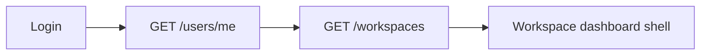

### Phase 2 — Email delivery + templates (3–4 weeks)

| Task | Notes |
|------|-------|
| Integrate ESP (Resend recommended) | Replace `EmailService` stub |
| `templates` table + module | `workspace_id`, name, `content` JSON, status |
| Template CRUD API | All routes under `/workspaces/:id/templates` |
| Builder storage format | Define JSON schema for blocks (separate from HTML) |
| Render pipeline | JSON → HTML (server-side for sends) |
| Template preview endpoint | `POST …/preview` returns HTML |

### Phase 3 — Contacts & lists (2–3 weeks)

| Task | Notes |
|------|-------|
| `contacts`, `contact_lists`, `list_contacts` tables | Unique `(workspace_id, email)` |
| Import CSV endpoint | Async job later; sync MVP first |
| List CRUD + add/remove contacts | |
| Unsubscribe flag on contact | Required before real sends |

### Phase 4 — Campaigns & sends (4–5 weeks)

| Task | Notes |
|------|-------|
| `campaigns` table | draft → scheduled → sending → sent |
| Campaign CRUD | Link template + list |
| `campaign_sends` + status tracking | per recipient |
| Queue + worker app | `apps/worker` or BullMQ in API |
| Send endpoint returns `202` | Job id for polling |
| Rate limiting + batch size | Protect ESP quotas |

### Phase 5 — Analytics & webhooks (3–4 weeks)

| Task | Notes |
|------|-------|
| `email_events` table | delivered, opened, clicked, bounced |
| ESP webhook ingress | `POST /webhooks/esp` (public, signed) |
| Campaign stats API | aggregates per campaign |
| Web dashboard charts | opens, clicks, bounces over time |

### Phase 6 — Senior polish (ongoing)

- [ ] Structured logging + request IDs
- [ ] Rate limits on `/auth/*`
- [ ] OpenAPI spec from Nest decorators
- [ ] Integration tests (Testcontainers)
- [ ] Observability (health, metrics)
- [ ] Feature flags per workspace (billing later)

---

## 9. Web app architecture (target)

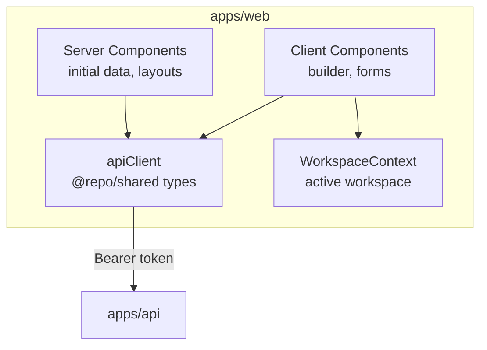

| Route group | Purpose |
|-------------|---------|
| `(auth)/login`, `sign-up` | Public |
| `(app)/[workspaceSlug]/` | Workspace-scoped app |
| `(app)/[workspaceSlug]/templates` | Builder |
| `(app)/[workspaceSlug]/contacts` | Audience |
| `(app)/[workspaceSlug]/campaigns` | Campaigns |
| `(app)/[workspaceSlug]/settings` | Workspace + members |

---

## 10. Service boundaries (rules)

1. **Controllers** — HTTP only: parse input, call one service, return DTO.
2. **Services** — business logic; may use `db.transaction()`.
3. **Orchestrators** (`RegistrationService`) — multi-domain workflows only.
4. **Guards** — authz only; no business logic.
5. **`@repo/shared`** — every public request/response shape.
6. **`AccountsService`** — never exposed via HTTP directly.
7. **Workspace scope** — every query filters by `workspace_id` from guard, never from body alone.

---

## 11. Milestone checklist (portfolio-ready)

| Milestone | Demo-able outcome |
|-----------|-------------------|
| **M1** | Sign up → land in default workspace |
| **M2** | Create template in builder, save, preview |
| **M3** | Import contacts, create list |
| **M4** | Create campaign, send to list, see delivery status |
| **M5** | View open/click analytics |
| **M6** | Invite teammate, role-restricted actions |

---

## 12. What to build next (recommended order)

```
1. CORS + health + E2E tests          ← close Phase 0
2. Real EmailService (Resend)         ← unblocks all email flows
3. Templates module (API first)       ← first product domain
4. Web: auth + workspace shell        ← parallel once #1 done
5. Contacts → Lists → Campaigns       ← core product loop
6. Queue + worker                       ← before bulk send
7. Webhooks + analytics                 ← complete the loop
```

---

*Last updated: reflects codebase through auth, onboarding, users, workspaces, and stub email delivery.*
