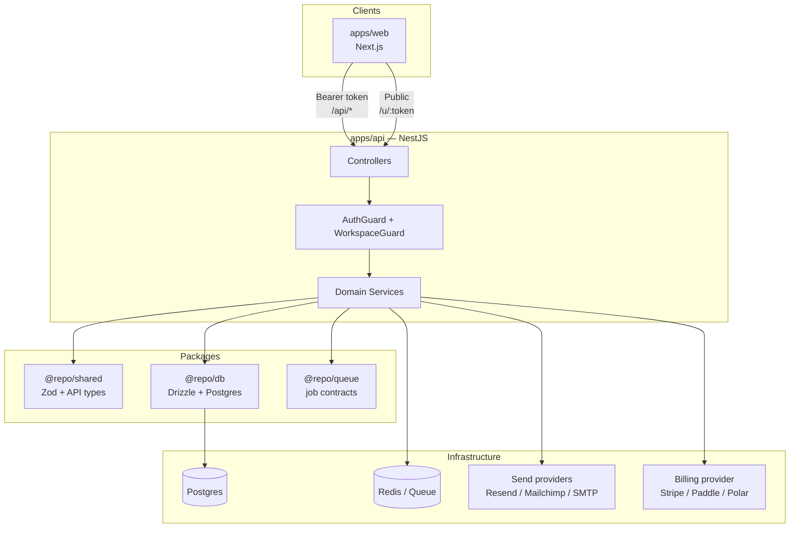
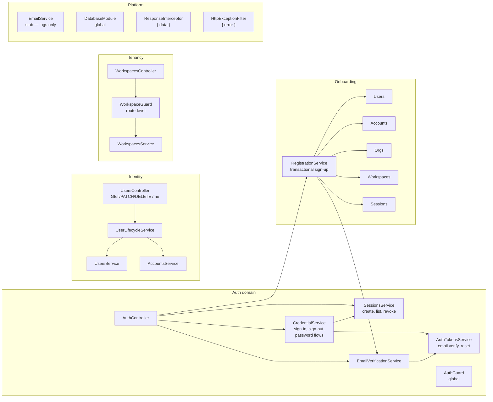
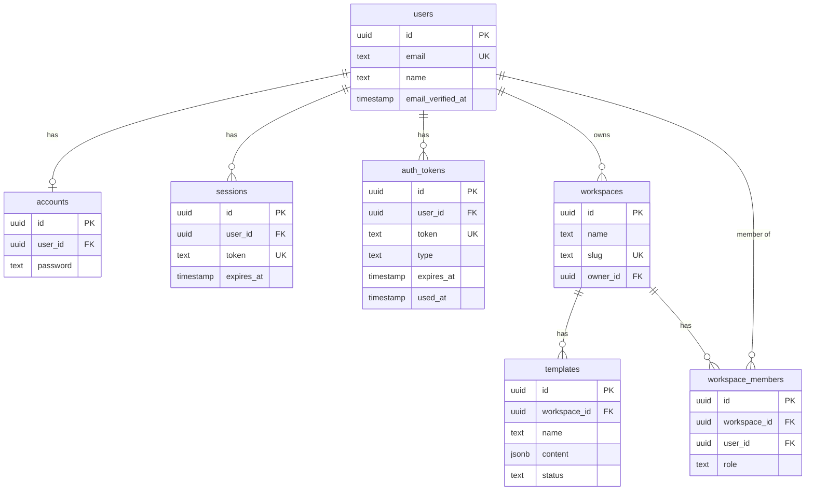
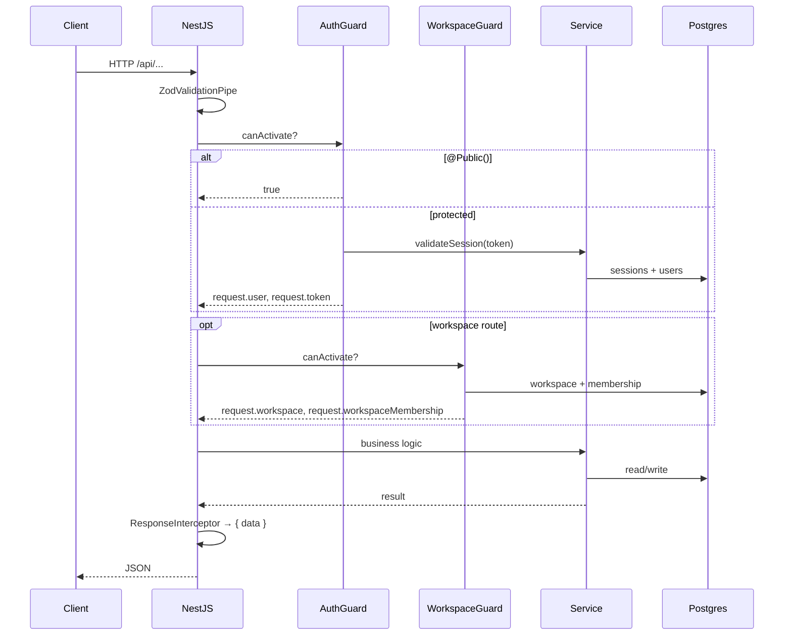
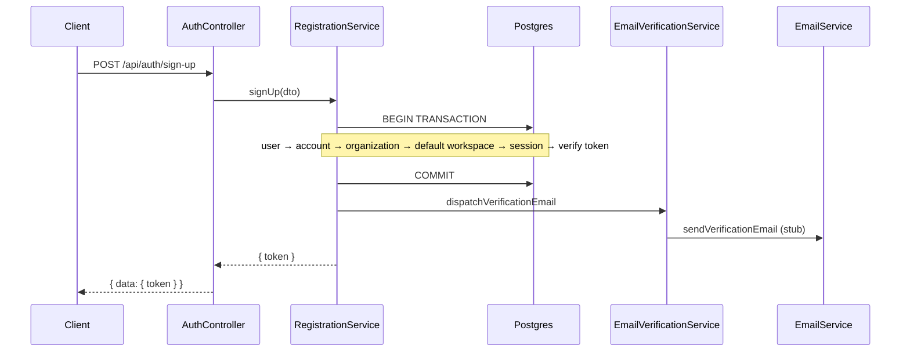
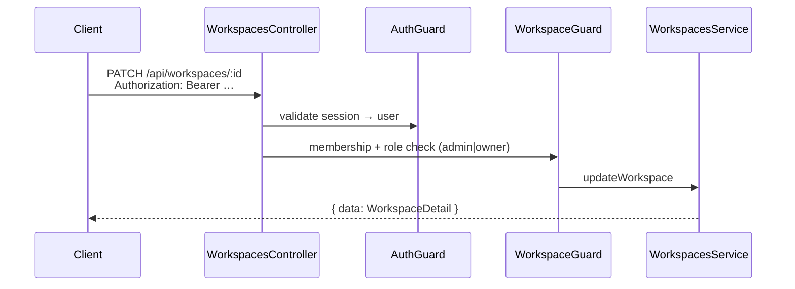
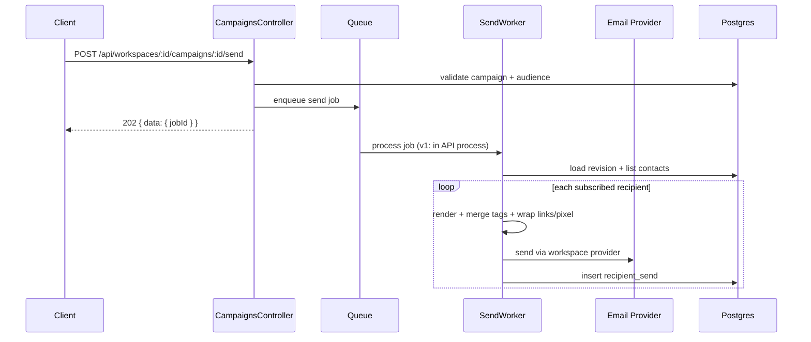
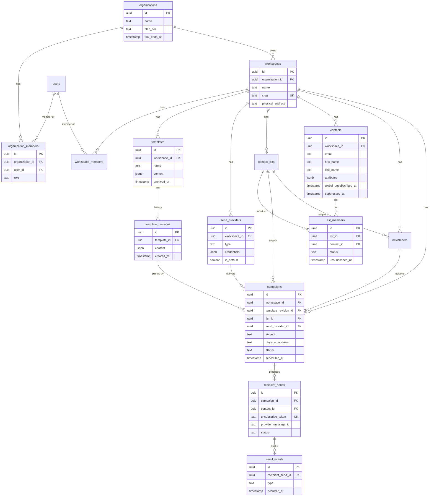
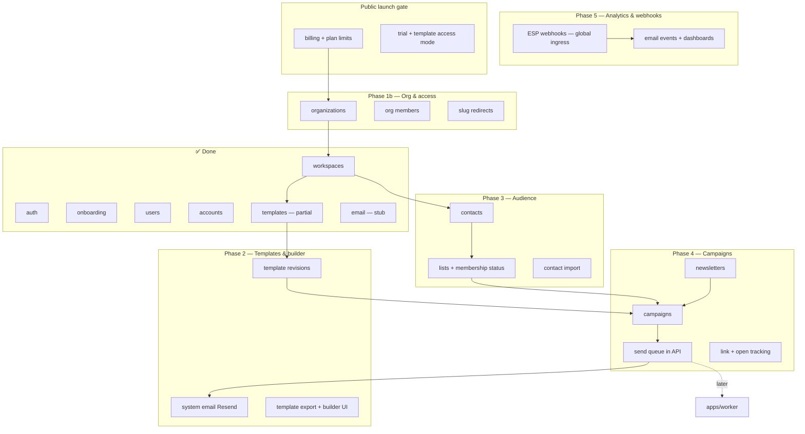
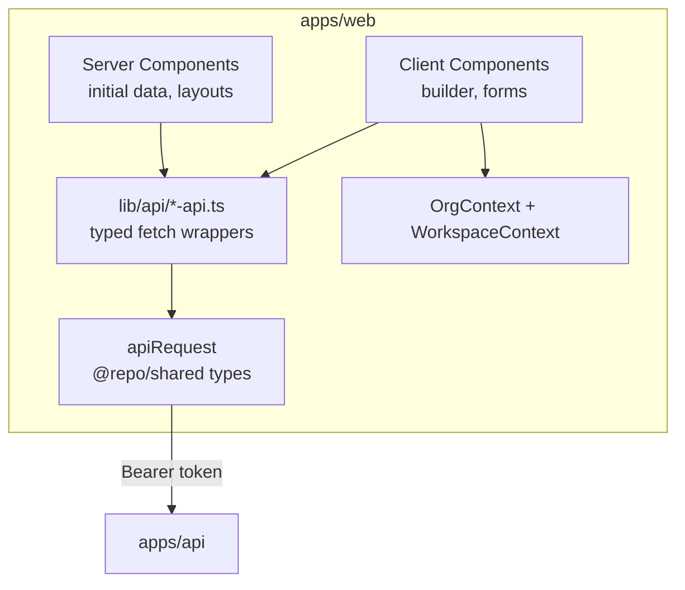

# Impact Inbox — Architecture & Roadmap

Email marketing platform (builder, campaigns, newsletters). Monorepo, contract-first API, **organization + workspace** multi-tenancy.

**Domain language:** [CONTEXT.md](../CONTEXT.md)  
**Recorded decisions:** [docs/adr/](adr/) — auth seam, workspace access, template render, block registry, [email product domain model](adr/0005-email-product-domain-model.md), [organization billing](adr/0006-organization-billing-model.md)

---

## 1. Product vision

| Layer | Responsibility |
|-------|----------------|
| **Web** (`apps/web`) | Builder UI, campaigns, analytics, public unsubscribe preference pages |
| **API** (`apps/api`) | Auth, org/workspace tenancy, business rules, queue processors (v1), webhooks |
| **Shared** (`packages/shared`) | Zod schemas, API types, constants — single contract for API + web |
| **DB** (`packages/db`) | Drizzle schema, migrations, typed queries |
| **Queue** (`packages/queue`) | Job names + payload schemas only — no Redis/BullMQ client |
| **Workers** (later) | Extract queue processors from API when load requires |

---

## 2. Monorepo topology



---

## 3. Current state (implemented)

### 3.1 API modules & responsibilities



| Module | Service | Does | Does not |
|--------|---------|------|----------|
| **Auth** | `CredentialService` | Sign-in/out, change/forgot/reset password | Create users, workspaces |
| **Auth** | `SessionsService` | Session CRUD, validation | Issue JWT |
| **Auth** | `AuthTokensService` | One-time tokens (verify email, reset pwd) | Send emails |
| **Auth** | `EmailVerificationService` | Token lifecycle + dispatch | Store passwords |
| **Onboarding** | `RegistrationService` | Atomic sign-up orchestration | Standalone HTTP routes |
| **Users** | `UsersService` | User persistence | Auth decisions |
| **Users** | `UserLifecycleService` | Profile update, account deletion | Raw CRUD exposure |
| **Accounts** | `AccountsService` | Password hash storage | HTTP layer |
| **Workspaces** | `WorkspacesService` | Workspace + member CRUD | Cross-workspace queries |
| **Email** | `EmailService` | Delivery abstraction (stub) | Template rendering |

### 3.2 Database (current)



_Planned:_ organizations, template_revisions, remove template draft/published status — see §5 and ADR 0005/0006.

### 3.3 Request pipeline (every API call)



---

## 4. Core data flows

### 4.1 Sign-up (implemented)



### 4.2 Authenticated workspace request (implemented)



### 4.3 Campaign send (target — not built)



---

## 5. Target domain model

**Organization** owns billing and plan limits. **Workspace** owns product data. See ADR 0005 and ADR 0006.



---

## 6. Target module map (API)



**Dependency rules:**

- Product routes stay under `/api/workspaces/:workspaceId/*` (templates, contacts, campaigns, etc.). Organization routes live separately at `/api/organizations/:orgId/*` (members, billing, create workspace). Web uses workspace slug in URLs; API continues to use workspace id — org id is not nested in every product path.
- Feature modules use `WorkspaceGuard`; queries filter by `workspace_id` from the route. `WorkspaceGuard` resolves the workspace’s `organization_id` for limit checks.
- Org-scoped routes use `OrganizationGuard` (org membership + role).
- Org limits enforced at organization scope before send, workspace create, or admin invite.
- Job payloads live in `@repo/queue`; API enqueues, processors run in API v1.

---

## 7. Shared contract strategy

```
packages/shared/src/
├── schemas/                    # Zod — one folder per domain
│   ├── auth/                   # sign-in, sessions, tokens
│   ├── organization/           # org, members, billing inputs
│   ├── workspace/              # workspace, members (migrate from workspace.ts)
│   ├── template/               # content, blocks, settings, revisions
│   ├── contact/                # contacts, lists, import (Phase 3)
│   ├── campaign/               # campaigns, newsletters (Phase 4)
│   ├── api.ts                  # ApiResponse, error codes
│   └── index.ts                # barrel — only public import surface
├── constants/                  # enums, TTLs, plan caps — split by domain
│   ├── auth.ts
│   ├── organization.ts
│   ├── billing.ts
│   ├── template.ts
│   └── index.ts
├── auth-responses.ts           # migrate → schemas/auth/responses.ts
└── index.ts                      # re-export schemas + constants
```

**Rules:**

- **Domain folders** — mirror API modules and CONTEXT vocabulary (`organization`, `workspace`, `template`, not generic `utils`).
- **Barrel exports** — apps import from `@repo/shared` only; no deep paths like `@repo/shared/schemas/template/blocks/content`.
- **Single package** — no `@repo/contracts` split until shared becomes a genuine bottleneck.
- **Migrate incrementally** — flat files (`workspace.ts`, monolithic `constants.ts`) move into domain folders as each phase lands; old paths re-export from barrels until callers updated.

| Consumer | Uses shared for |
|----------|-----------------|
| `apps/api` | DTOs via `createZodDto`, response types |
| `apps/web` | Form validation, fetch response typing |
| `packages/db` | Enums aligned with constants (e.g. `WorkspaceRole`, org roles) |
| `packages/queue` | Job payload schemas (Phase 4) |

**Convention:** every public endpoint has a Zod schema + exported inferred type in `@repo/shared` before the web app calls it.

**Web API client:** per-domain modules under `apps/web/src/lib/api/` (e.g. `auth-api.ts`, `templates-api.ts`) wrapping shared `apiRequest`. Client components may add TanStack Query hooks that call these modules; RSC and server actions import the same modules directly.

### DB schema layout (`packages/db`)

```
packages/db/src/schema/
├── auth/              # users, accounts, sessions, auth_tokens
├── organization/      # organizations, organization_members
├── workspace/         # workspaces, workspace_members, slug_redirects
├── template/          # templates, template_revisions
├── contact/           # contacts, contact_lists, list_members (Phase 3)
├── campaign/          # campaigns, newsletters, recipient_sends (Phase 4)
├── analytics/         # email_events (Phase 5)
├── _helpers.ts
└── index.ts           # barrel — single schema export for Drizzle
```

One table per file inside each domain folder. Migrate existing flat files (`workspaces.ts`, `templates.ts`, etc.) into domain folders incrementally. Migrations committed under `packages/db/drizzle/`.

### API module layout (`apps/api`)

```
apps/api/src/
├── auth/              # sessions, credentials, tokens, guards
├── onboarding/        # RegistrationService orchestrator
├── users/
├── accounts/          # internal only — no HTTP controller
├── organizations/     # OrganizationGuard, billing hooks (Phase 1b / 6)
├── workspaces/        # WorkspaceGuard
├── templates/
├── contacts/          # Phase 3
├── campaigns/         # campaigns, newsletters, send queue processors (Phase 4)
├── webhooks/          # global ESP ingress (Phase 5)
├── billing/           # provider adapter, PlanLimitsService, usage meters (Phase 6)
├── email/             # system email deliver interface
└── database/
```

One NestJS module per domain folder (controller + service + guards + dto). Processors for the send queue live in `campaigns/` for v1; extract to `apps/worker` later without changing `@repo/queue` payloads.

**Plan limits:** central `PlanLimitsService` in `billing/` — single place for tier caps, trial/template-access mode, and usage meters. Domain modules (`workspaces`, `contacts`, `campaigns`) call assert helpers (`assertCanSend`, `assertCanImport`, `assertCanAddWorkspace`, etc.); no duplicated cap logic in each service.

### Queue contracts (`packages/queue`)

```
packages/queue/src/
├── jobs/                  # one file per job type
│   ├── send-campaign.ts   # name constant + payload Zod schema
│   └── import-contacts.ts
└── index.ts               # barrel
```

Contracts only — job names, payload Zod schemas, inferred types. No Redis/BullMQ connection or processors; those live in `apps/api/src/campaigns/` (v1) and later `apps/worker`. API and worker import the same payloads so extraction does not change job shape.

---

## 8. Phased roadmap

**Open work (Phases 0–2):** [deferred-work.md](./deferred-work.md) — master checklist for everything **not done** or **partial**.

### Phase 0 — Foundation ✅ (mostly done)

- [x] Monorepo + NestJS + Drizzle + Postgres + Redis (docker-compose)
- [x] Global `/api` prefix, `{ data }` / `{ error }` envelope
- [x] Auth: sessions, sign-up/in/out, password flows, email verification tokens
- [x] Users: `/users/me`, profile, delete account
- [x] Workspaces: CRUD, members, roles, `WorkspaceGuard`
- [x] Templates module (partial — no revisions yet; remove draft/published status)
- [x] Transactional registration (user + account + workspace + session)
- [x] CORS for `apps/web`
- [x] `GET /api/health`
- [ ] Drizzle migrations committed + CI migrate → [deferred-work.md §5](./deferred-work.md#5-drizzle-migrations--ci-migrate)
- [x] Auth + workspace E2E tests

### Phase 1 — Web shell (2–3 weeks)

Goal: authenticate, org/workspace navigation, slug URLs.

| Task | API | Web |
|------|-----|-----|
| API client + token storage | — | `lib/api-client.ts` |
| Login / sign-up pages | existing routes | forms + Zod from shared |
| Session bootstrap | `GET /users/me` | layout + redirect |
| Org + workspace switcher | list orgs + workspaces | URL `/[workspaceSlug]/…` |
| Error handling | stable error codes | toast / form errors |

### Phase 1b — Organizations (1–2 weeks)

- [x] `organizations`, `organization_members` tables
- [x] Registration creates org + default workspace; trial clock *(placement fix still open — [deferred-work.md](./deferred-work.md) §2)*
- [x] GitLab-style invites: workspace invite adds org membership; org member CRUD API
- [x] Workspace slug change with redirects table
- [x] Org roles: owner, org admin, member (API + guard)
- [x] Org member management UI, create-workspace UI
- [ ] Email invite tokens — [ADR 0011](./adr/0011-email-invite-tokens.md); interim: existing users only ([deferred-work.md](./deferred-work.md))

### Phase 2 — Templates & builder (3–4 weeks)

Goal: M2 — build template, Save revision, preview, export. See [ADR 0007](./adr/0007-phase-2-templates-scope.md).

| Task | Notes |
|------|-------|
| [x] `template_revisions` table + Save/restore | Working copy vs revision (ADR 0005) |
| [x] `templateSettings`: subject, width 480–700 | Part of working copy JSON |
| [x] System `EmailService` (Resend) | Verification, reset |
| [x] Template export API | HTML + plain text; `PlanLimitsService.canExport` stub |
| [x] Template list + builder UI | Full palette, structure panel, autosave, revision history |
| [x] Archive-only | No hard delete until Phase 4 |
| [x] Image blocks | External URL only (upload later) |
| [x] Optimistic concurrency | ADR 0010 — all template writes guard on `updatedAt` |

### Phase 3 — Contacts & lists (2–3 weeks)

| Task | Notes |
|------|-------|
| `contacts`, `contact_lists`, `list_members` | `subscribed` / `pending` / unsubscribed |
| Import CSV | Sync under cap; async above; merge duplicates |
| Unsubscribe model | List + global; preference page on web |
| Double opt-in per list | Confirm via system email |

### Phase 4 — Campaigns & sends (4–5 weeks)

| Task | Notes |
|------|-------|
| `campaigns`, `newsletters`, `recipient_sends` | Pin `template_revision_id` at execution |
| Workspace `send_providers` module | Resend/Mailchimp/SMTP; multi + default (deferred from Phase 2) |
| Send queue (`@repo/queue` + BullMQ in API) | `202` on send; v1 processors in API |
| Merge tags + test send | Sample or pick contact |
| Unsubscribe footer + address overrides | Token per recipient send |
| Link redirect + open pixel | Platform domain v1 |
| Campaign duplicate | New draft from existing |

### Phase 5 — Analytics & webhooks (2–3 weeks)

| Task | Notes |
|------|-------|
| `email_events` table | Per recipient send |
| Global `POST /webhooks/esp` | Route by provider message id |
| Campaign + template analytics APIs | Per-link breakdown later |
| Web dashboards | Opens, clicks, bounces |

### Phase 6 — Public launch gate (required before users)

- [ ] Billing provider adapter (Stripe / Paddle / Polar)
- [ ] Plan tiers + usage meters (sends, workspaces, seats)
- [ ] Hard limits + send top-ups
- [ ] 7-day trial → template access mode (5 exports/mo)
- [ ] Org owner billing portal

### Phase 7 — Polish (ongoing)

- [ ] Extract `apps/worker` from queue processors
- [ ] Custom tracking domains (paid)
- [ ] Newsletter automated cadence
- [ ] Workspace transfer between orgs
- [ ] OpenAPI, observability, rate limits

---

## 9. Web app architecture (target)



| Route group | Purpose |
|-------------|---------|
| `(auth)/sign-in`, `sign-up` | Public |
| `(public)/u/[token]` | Unsubscribe preference page |
| `(app)/[workspaceSlug]/` | Workspace-scoped app |
| `(app)/[workspaceSlug]/templates` | Builder + revision history + export |
| `(app)/[workspaceSlug]/contacts` | Audience |
| `(app)/[workspaceSlug]/campaigns` | Campaigns + newsletters |
| `(app)/[workspaceSlug]/settings` | Workspace, providers, members |
| `(app)/org/[orgId]/settings` | Org members, billing (owner) |

Org-scoped pages include `orgId` in the URL — no server-side “active org” on the session. Workspace pages infer organization from the workspace record. Org switcher navigates between org URLs.

**Slug → id:** `(app)/[workspaceSlug]/layout.tsx` resolves slug via `GET /api/workspaces/by-slug/:slug` (only slug-based API route). `WorkspaceContext` holds `id` + `slug`; all other API calls use `/api/workspaces/:id/*`.

---

## 10. Service boundaries (rules)

1. **Controllers** — HTTP only: parse input, call one service, return DTO.
2. **Services** — business logic; may use `db.transaction()`.
3. **Orchestrators** (`RegistrationService`) — multi-domain workflows only.
4. **Guards** — authz only; no business logic.
5. **`@repo/shared`** — every public request/response shape.
6. **`AccountsService`** — never exposed via HTTP directly.
7. **Workspace scope** — product queries filter by `workspace_id` from guard, never from body alone.
8. **Organization scope** — billing, trial, and plan limits resolve at organization level. Org routes: `/api/organizations/:orgId/*`. Product routes: `/api/workspaces/:workspaceId/*` (no org id in path).
9. **Organization guard** — org-scoped endpoints use `OrganizationGuard` (membership + role); workspace endpoints use `WorkspaceGuard`.
10. **Billing provider** — swappable adapter; domain code never imports vendor SDK types.
11. **Plan limits** — enforced via central `PlanLimitsService` in `billing/`; not duplicated per module.
12. **Public launch** — billing + limit enforcement ship with first public release.

---

## 11. Milestone checklist (portfolio-ready)

| Milestone | Demo-able outcome |
|-----------|-------------------|
| **M1** | Sign up → org + default workspace → 7-day trial starts on first login |
| **M2** | Build template, Save revision, preview, export HTML+text |
| **M3** | Import contacts, create list, double opt-in optional |
| **M4** | Campaign send to list via workspace provider; recipient status |
| **M5** | Campaign + template analytics; click/open tracking |
| **M6** | Org invite, workspace roles, billing + limits at launch |

---

## 12. What to build next (recommended order)

```
1. Close Phase 0 (CORS, health, migrations, E2E)
2. Phase 1 web shell + Phase 1b organizations
3. Phase 2 — template revisions, builder, export, system email (ADR 0007)
4. Contacts → lists (Phase 3)
5. Campaigns + workspace send providers + send queue (Phase 4)
6. Tracking + webhooks + analytics (Phase 5)
7. Billing + trial + template access mode  ← public launch gate (Phase 6)
8. Extract apps/worker when needed
```

---

*Last updated: reflects grilling decisions in CONTEXT.md, ADR 0005, ADR 0006, and codebase through auth, workspaces, templates (partial).*
