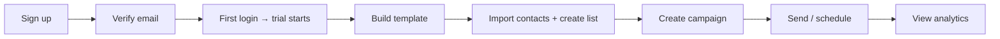

# Impact Inbox — Design Brief (prototyping aid)

> **Not the product spec.** Domain language, lifecycle rules, and phased scope live in [CONTEXT.md](../CONTEXT.md) and [architecture-roadmap.md](./architecture-roadmap.md) §8. Use those for engineering decisions. This file helps AI design tools prototype screens — it may lag the codebase.

**Engineering roadmap:** [architecture-roadmap.md](./architecture-roadmap.md) §8–9

---

## What's built in code (as of Phase 2)

| Area | Status |
|------|--------|
| Auth shell (sign-in/up, verify, reset) | Done |
| Session bootstrap, slug URLs, org/workspace switcher | Done |
| Template list, builder, revisions, export zip | Done |
| Org settings page | Read-only org info |
| Org member management UI | Not built (API: list/invite/role/remove) |
| Workspace settings, create workspace UI | Stubs / API only |
| Contacts, campaigns, billing | Phase 3+ |

---

## 1. Product in one paragraph

**Impact Inbox** is an email marketing platform: visual template builder, contact lists, campaigns, newsletters, and send analytics. Customers belong to an **Organization** (billing + plan limits) and work inside **Workspaces** (contacts, templates, campaigns). Solo users get one org + one workspace automatically. Agencies use multiple workspaces (one per client). The product competes with Mailchimp/MailerLite on clarity and builder quality — not as an export-only ESP sync tool.

---

## 2. Users & roles (affects what UI shows)

| Actor | Can see | Can do |
|-------|---------|--------|
| **Org owner** | Everything + billing | Subscribe, top-ups, invite org members, create workspaces, all workspace admin actions |
| **Org admin** | Org members, workspaces | Create workspaces, invite members — **no billing** |
| **Org member** | Only assigned workspaces | Depends on workspace role |
| **Workspace owner/admin** | Full workspace | Templates, contacts, campaigns, send providers, members |
| **Workspace member** | Templates, send history, analytics | **View only** — cannot send or mutate audience |

**Trial:** 7 days full access after first login post email verification. No card required.  
**After trial (unpaid):** **Template access mode** — edit templates + view past analytics; sends/contacts/lists locked; export capped (~5/month).

---

## 3. Information architecture

```
Public
├── /sign-in, /sign-up
├── /verify-email (token link)
├── /forgot-password, /reset-password
└── /u/[token]                    ← unsubscribe preference page (no login)

Authenticated
├── /[workspaceSlug]              ← workspace home / dashboard
├── /[workspaceSlug]/templates
├── /[workspaceSlug]/templates/[id] ← builder (full-screen)
├── /[workspaceSlug]/contacts
├── /[workspaceSlug]/contacts/[listId]
├── /[workspaceSlug]/campaigns
├── /[workspaceSlug]/campaigns/[id]
├── /[workspaceSlug]/newsletters
├── /[workspaceSlug]/newsletters/[id]
└── /[workspaceSlug]/settings     ← workspace: providers, members, address

Org-scoped (org id in URL — not nested under workspace)
└── /org/[orgId]/settings        ← members, billing, usage meters, plan
```

**Navigation pattern (already in code):** Top header with product name + org/workspace switcher + user menu. Secondary horizontal nav under header: Overview | Templates | Contacts | Campaigns | Settings.

**URL rule:** Workspace pages use human **slug** (`/acme-corp/templates`). Org pages use **org id** (`/org/uuid/settings`).

---

## 4. Screen inventory (prototype priority)

### P0 — Shell & auth (partially built; polish + empty states)

| Screen | Key elements |
|--------|----------------|
| Sign in / Sign up | Email + password; link to other flow; verify-email notice after signup |
| Workspace overview | Quick stats placeholders, recent campaigns, trial banner, usage summary link to org settings |
| Org/workspace switcher | Dropdown: org name → list workspaces; switch org navigates to that org's settings or last workspace |
| Org settings | Plan tier, trial countdown, usage meters (future), billing portal (owner only), **member list + invite** (target UI — API exists) |
| Workspace settings | Name, slug, physical address (CAN-SPAM), send providers, members & roles |

### P1 — Templates (hero feature)

| Screen | Key elements |
|--------|----------------|
| Template list | Grid/list, search, create, archive filter, empty state |
| Template builder | **Left sidebar** (Blocks / Structure tabs) · **center** canvas preview · **right** inspector. Top bar: name, working-copy sync badge, Save (revision), Preview, History, Export |
| Structure panel | Tree: section → row → column → blocks. Add/remove layout nodes here (not drag on canvas) |
| Revision history | Sidebar or modal: timestamped saves, restore (with confirm) |
| Preview modes | Desktop ~600px width canvas; mobile ~375px toggle — same HTML |

**Builder blocks (palette must include all):**

Layout: Section, Row, Column  
Content: Heading, Text, Rich Text, Button, Image, Logo, Video, Divider, Spacer, Social Links, HTML, Table, Shape, Footer, QR Code

**Builder rules:**
- Content blocks: drag-and-drop reorder within/between columns
- Layout blocks: structure panel only (no free-form section drag in v1)
- Working copy autosaves (badge: Synced / Unsaved changes / Syncing…)
- Explicit Save = new revision in history
- Merge tag picker: contact fields + reserved tags (`unsubscribeUrl`, `physicalAddress`, `listName`, `workspaceName`, `currentYear`)

### P2 — Audience

| Screen | Key elements |
|--------|----------------|
| Contacts | Table: email, name, lists, status; search; add contact; import CSV |
| Contact detail | Core fields + custom attributes; list memberships; global unsubscribe / suppressed badges |
| Lists | List cards; member count; double opt-in toggle per list |
| List detail | Members table with status: subscribed / pending / unsubscribed; import to list |
| Import flow | Upload CSV → column mapping → preview → progress (sync or async) |

### P3 — Campaigns & sends

| Screen | Key elements |
|--------|----------------|
| Campaign list | Status chips: draft, scheduled, sending, sent, failed; filter by status |
| Campaign editor | Pick template (or pinned revision), list, send provider, subject override, physical address override, schedule or send now |
| Campaign detail / analytics | Sent date, audience size, opens/clicks/bounces/complaints; recipient table drill-down |
| Test send | Modal: up to N arbitrary emails, optional sample contact for merge tags |
| Newsletters | Recurring config; "Send edition" creates campaign; edition history = past campaigns |
| Send provider settings | Resend / Mailchimp / SMTP cards; default provider; masked credentials |

### P4 — Public & billing states

| Screen | Key elements |
|--------|----------------|
| Unsubscribe preference (`/u/[token]`) | List unsubscribe + global unsubscribe; no account required; minimal branded page |
| Trial expired / locked feature | Inline lock on send/import/contacts with CTA to subscribe |
| Upgrade / top-up | Plan comparison (Starter / Growth / Agency); send top-up packs (+5k, +25k) |
| Over-limit states | Block send/import/invite; allow read + analytics |

---

## 5. Key user flows (for journey prototypes)



**Agency flow:** Owner creates org → multiple workspaces → invite org admin → assign to client workspaces.

**Template-only unpaid flow:** Trial ends → user keeps editing templates → export capped → subscribe to unlock sends.

---

## 6. Plan limits (show in org settings UI)

| Tier | Contacts | Sends/period | Workspaces | Admin seats |
|------|----------|--------------|------------|-------------|
| Starter | 500 | 5,000 | 1 | 2 |
| Growth | 2,500 | 25,000 | 3 | 5 |
| Agency | 10,000 | 100,000 | 10 | 15 |

Usage meters: progress bars for contacts, sends (resets on billing period), workspaces, admin seats. Over limit → block sends, imports, new workspaces, admin invites; still allow read/edit/analytics.

---

## 7. Visual & UX direction

**Category:** B2B SaaS — email marketing / CRM-adjacent.  
**Tone:** Professional, calm, trustworthy. Not playful consumer social. Clear hierarchy for data-heavy tables and the builder.

**References (mood, not copy):**
- Mailchimp / MailerLite — familiar patterns for lists and campaigns
- Linear / Resend — clean developer-grade SaaS chrome for shell/nav
- Notion / Figma — builder panel density and property inspector patterns

**Technical constraints for handoff to engineering:**
- Next.js App Router, React Server Components where possible
- Tailwind CSS; shadcn/ui + Radix primitives
- Dark mode support (system preference)
- Responsive: builder is desktop-first; shell and lists must work on tablet; public unsubscribe page mobile-first
- Fonts in codebase today: Geist Sans / Geist Mono (can propose alternatives)

**Avoid:**
- Marketing-site chrome inside the app (keep app shell distinct from future landing page)
- "Draft/Published" on templates — only **Archived** is a lifecycle state
- Per-workspace billing UI — always org-level
- Feature-gated tiers at launch — all tiers get same features, different limits only

---

## 8. Canonical terminology (use in UI copy)

| Use | Don't use |
|-----|-----------|
| Workspace | Tenant, account |
| Organization | Team (ambiguous) |
| Contact | Subscriber, lead |
| Contact list | Segment, audience |
| Campaign | Blast, broadcast |
| Template revision | Version (reserved for JSON schema) |
| Send provider | ESP integration |
| Merge tag | Variable |
| Template access mode | Free tier |

Full glossary: [CONTEXT.md](../CONTEXT.md)

---

## 9. Out of scope for v1 prototypes

- Dollar prices on plan cards (limits yes, prices TBD)
- Org invite flow variant (email vs link) — show generic invite modal
- Custom tracking domains
- Automated newsletter cadence (manual "send edition" only)
- Per-link click analytics breakdown
- HTML-to-blocks import
- Workspace transfer between orgs

---

## 10. AI designer session prompts

Copy one block per session. Attach this file or paste the P0/P1 section as context.

### Session A — App shell

```
Design the authenticated app shell for Impact Inbox, an email marketing SaaS.

Include: top header (logo, org/workspace switcher, user menu), horizontal nav (Overview, Templates, Contacts, Campaigns, Settings), workspace overview dashboard with trial banner and placeholder stat cards, org settings page with plan usage meters (contacts, sends, workspaces, admin seats) and member list.

Style: clean B2B SaaS, Tailwind/shadcn-compatible, light + dark mode. Desktop-first.
Routes: /[workspaceSlug], /org/[orgId]/settings
```

### Session B — Template builder (priority)

```
Design the email template builder for Impact Inbox.

Layout (matches shipped app):
- Left sidebar with tabs: Blocks palette | Structure tree (section → row → column → content blocks)
- Center: iframe canvas preview; desktop/mobile width toggle in preview overlay
- Right: block inspector or template settings

Top bar: template name, working-copy sync badge, Save (creates revision), Preview, History, Export, back link.

Block palette: Section, Row, Column, Heading, Text, Rich Text, Button, Image, Logo, Video, Divider, Spacer, Social, HTML, Table, Shape, Footer, QR.

Canvas is preview-only (selection via Structure panel + inspector — ADR 0008). Content blocks reorder via DnD in Structure panel. Revision history drawer, merge tag warnings.

Professional email-builder UX; reference Mailchimp builder density with Linear-style chrome.
```

### Session C — Contacts & lists

```
Design Contacts and Contact lists for Impact Inbox email marketing app.

Screens: contacts table with search and status badges (subscribed, pending, unsubscribed, suppressed), contact detail with custom attributes, lists overview, list detail with member statuses, CSV import wizard (upload → map columns → preview).

Match the app shell from Session A. Data-dense tables, clear empty states.
```

### Session D — Campaigns & analytics

```
Design Campaigns for Impact Inbox.

Screens: campaign list with status filters (draft, scheduled, sending, sent, failed), campaign editor (template picker, list, send provider, subject line, schedule/send), campaign analytics dashboard (opens, clicks, bounces, complaints, recipient table), test send modal, newsletters list with "send edition" action.

Include locked-state UI when trial expired (template access mode).
```

### Session E — Public unsubscribe page

```
Design a minimal public page at /u/[token] for email recipients to unsubscribe.

No login. Options: unsubscribe from this list, unsubscribe from all emails in workspace. Include workspace branding area, CAN-SPAM compliant copy, confirmation state. Mobile-first.
```

---

## 11. Handoff to engineering

When prototypes are approved:

1. Map screens to routes in §3
2. Extract design tokens → `apps/web` Tailwind theme
3. Build shadcn components in `packages/ui` or `apps/web/src/components/ui`
4. Implement in roadmap order: shell (done) → templates → contacts → campaigns → analytics → billing

**Existing code to extend:** `apps/web/src/components/app/`, `apps/web/src/app/(app)/`
